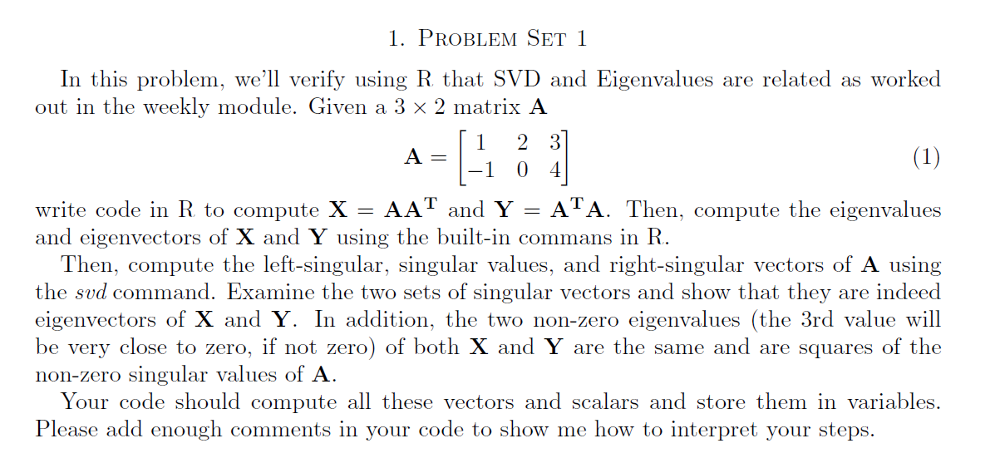
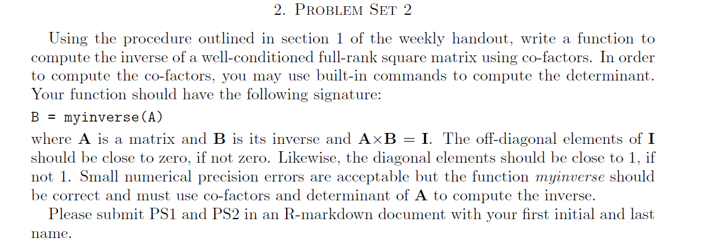

**_1. Write code in R to compute $X = A{A^T}$ and $Y = {A^T}A$._**
```{r, echo=T}
#create a matrix
A = matrix(c(1,-1, 2,0, 3,4), nrow=2, byrow=FALSE)

#calculate transpose of matrix A
A.transpose = t(A)

#calculate X = matrix A dot product of transpose of matrix A
#results in 2X2 matrix
X = A%*%A.transpose

#calculate Y = transpose of matrix A dot product of matrix A
#results in 3X3 matrix
Y = A.transpose%*%A
```

Matrix $A$ = $\left[\begin{array}{cc}`r A[1,1]` & `r A[1,2]` & `r A[1,3]` \\`r A[2,1]` & `r A[2,2]` & `r A[2,3]` \end{array}\right]$

Transpose of matrix ${A^T}$ = $\left[\begin{array}{cc}`r A.transpose[1,1]` & `r A.transpose[1,2]` \\ `r A.transpose[2,1]` & `r A.transpose[2,2]` \\ `r A.transpose[3,1]` & `r A.transpose[3,2]`\end{array}\right]$

Dot product of matrix A and transpose of matrix A, $X = A{A^T}$

$X$ = $\left[\begin{array}{cc}`r X[1,1]` & `r X[1,2]` \\`r X[2,1]` & `r X[2,2]`\end{array}\right]$

Dot product of transpose of matrix A and matrix A, $Y = {A^T}A$

$X$ = $\left[\begin{array}{cc}`r Y[1,1]` & `r Y[1,2]` & `r Y[1,3]`\\`r Y[2,1]` & `r Y[2,2]` & `r Y[2,3]` \\ `r Y[3,1]` & `r Y[3,2]` & `r Y[3,3]`\end{array}\right]$


**_2. Compute the eigenvalues and eigenvectors of X and Y using the built-in commans in R._**

The eigenvalues and eigenvectors will be calculated using R function **_eigen_**. Function **_eigen_** return two components **_values_** and **_vectors_**. The **_vectors_** are normalized to unit length.

```{r, echo=T}
#compute eigenvalues of X
X.eigenvalues = eigen(X)$values

#compute eigenvalues of X
X.eigenvectors = eigen(X)$vectors
```
Eigenvalues of $X$ are ${\lambda}_1 = `r X.eigenvalues[1]`$ and ${\lambda}_2 = `r X.eigenvalues[2]`$

Eigenvectors of $X$ are

For ${\lambda}_1 = `r X.eigenvalues[1]`$, ${\cal E}_{X}(`r X.eigenvalues[1]`) = \left[\begin{array}{cc}`r X.eigenvectors[1,1]` \\ `r X.eigenvectors[2,1]`\end{array}\right]$

${\lambda}_2 = `r X.eigenvalues[2]`$, ${\cal E}_{X}(`r X.eigenvalues[2]`) = \left[\begin{array}{cc}`r X.eigenvectors[1,2]` \\ `r X.eigenvectors[2,2]`\end{array}\right]$

```{r, echo=T}
#compute eigenvalues of Y
Y.eigenvalues = eigen(Y)$values

#compute eigenvalues of Y
Y.eigenvectors = eigen(Y)$vectors
```
Eigenvalues of $Y$ are ${\lambda}_1 = `r Y.eigenvalues[1]`$, ${\lambda}_2 = `r Y.eigenvalues[2]`$ and ${\lambda}_3 = `r options("scipen"=100, "digits"=20); Y.eigenvalues[3]`$

Eignevalue ${\lambda}_3$ has very small value, if rounded to 4 digits it is equal to zero. This value can be considered as mathematically significant, but practically non-significant.

Eigenvectors of $Y$ are

For ${\lambda}_1 = `r options("scipen"=100, "digits"=7); Y.eigenvalues[1]`$, ${\cal E}_{Y}(`r Y.eigenvalues[1]`) = \left[\begin{array}{cc}`r Y.eigenvectors[1,1]` \\ `r Y.eigenvectors[2,1]` \\ `r Y.eigenvectors[3,1]` \end{array}\right]$

${\lambda}_2 = `r Y.eigenvalues[2]`$, ${\cal E}_{Y}(`r Y.eigenvalues[2]`) = \left[\begin{array}{cc}`r Y.eigenvectors[1,2]` \\ `r Y.eigenvectors[2,2]` \\ `r Y.eigenvectors[3,2]`\end{array}\right]$

${\lambda}_2 = `r options("scipen"=100, "digits"=20); Y.eigenvalues[3]`$, ${\cal E}_{Y}(`r  Y.eigenvalues[3]`) = \left[\begin{array}{cc}`r options("scipen"=100, "digits"=7); Y.eigenvectors[1,3]` \\ `r Y.eigenvectors[2,3]` \\ `r Y.eigenvectors[3,3]`\end{array}\right]$


**_3. Compute the left-singular, singular values, and right-singular vectors of A using the svd command_**

The SVD decomposition of the matrix is computed by: $\mathbf{A = U \sum V^T}$.

Where $\mathbf{U}$, $\mathbf{V^T}$ are **_orthogonal matrices_** and $\sum$ is **_diagonal matrix_** with the singular values.

$\mathbf{U}$ = $\left[\frac{1}{{\sigma}_1}AV_1 . \frac{1}{{\sigma}_2}AV_2 .... \frac{1}{{\sigma}_i}AV_i . \frac{{\cal N}(A^T)}{|{\cal N}(A^T)|}\right]$

${\sigma}_i = \sqrt{{\lambda}_i}$, eigenvectors $\{{\lambda}_1, {\lambda}_2, ... {\lambda}_i\}$ of ${A^T}A$

$V_i =$ eigenvectors $\{V_1, V_2, ... V_i\}$ of ${A^T}A$

${\cal N}(A^T)$ is NullSpace of transpose of matrix $A$ and $|{\cal N}(A^T)|$ is magnitude of NullSpace of transpose of matrix $A$.

$\mathbf{V^T}$ = transpose of eigenvectors of ${A^T}A$ = ${({A^T}A)}^T$

$\sum$ = diagonal matrix of square root of eigenvalues of ${A^T}A$

Entire calculation can be computed by using R function **_svd_**.

```{r, echo=T}
#compute svd of matrix A
#dim(A)[1] is rows of matrix
#dim(A)[2] is cols of matrix

A.svd = svd(A, dim(A)[1], dim(A)[2])
#get u vectors
A.svd.u = A.svd$u
#get v vectors
A.svd.v = A.svd$v
#get diagonal matrix
A.svd.d = diag(A.svd$d)
A.svd.d.sq = diag(A.svd$d)%*%diag(A.svd$d)
```

Left-singular vectors of SVD are

$\mathbf{U}$ = $\left\{\left[\begin{array}{cc}`r A.svd.u[1,1]` \\ `r A.svd.u[2,1]` \end{array}\right] \left[\begin{array}{cc}`r A.svd.u[1,2]` \\ `r A.svd.u[2,2]` \end{array}\right] \right\}$

When left-singular vectors of SVD $\mathbf U$ are multiplied by $-1$ scalar, they are same as eigenvectors of $X$  

$\left\{\left[\begin{array}{cc}`r X.eigenvectors[1,1]` \\ `r X.eigenvectors[2,1]`\end{array}\right]  \left[\begin{array}{cc}`r X.eigenvectors[1,2]` \\ `r X.eigenvectors[2,2]`\end{array}\right]\right\}$

Right-singular vectors

$\mathbf{V}$ = $\left\{\left[\begin{array}{cc}`r A.svd.v[1,1]` \\ `r A.svd.v[2,1]` \\ `r A.svd.v[3,1]`\end{array}\right] \left[\begin{array}{cc}`r A.svd.v[1,2]` \\ `r A.svd.v[2,2]`\\`r A.svd.v[3,2]` \end{array}\right] \left[\begin{array}{cc}`r A.svd.v[1,3]` \\ `r A.svd.v[2,3]`\\`r A.svd.v[3,3]` \end{array}\right]\right\}$

When right-singular vectors of SVD $\mathbf V$ are multiplied by $-1$ scalar, they are same as eigenvectors of $Y$

$\left\{\left[\begin{array}{cc}`r Y.eigenvectors[1,1]` \\ `r Y.eigenvectors[2,1]` \\ `r Y.eigenvectors[3,1]` \end{array}\right] \left[\begin{array}{cc}`r Y.eigenvectors[1,2]` \\ `r Y.eigenvectors[2,2]` \\ `r Y.eigenvectors[3,2]` \end{array}\right] \left[\begin{array}{cc}`r Y.eigenvectors[1,3]` \\ `r Y.eigenvectors[2,3]` \\ `r Y.eigenvectors[3,3]` \end{array}\right]\right\}$

Singular values

$\sum$ = $\left\{\left[\begin{array}{cc}`r A.svd.d[1,1]` \\ `r A.svd.d[2,1]` \end{array}\right] \left[\begin{array}{cc}`r A.svd.d[1,2]` \\ `r A.svd.d[2,2]` \end{array}\right] \right\}$

**_4. Two non-zero eigenvalues (the 3rd value will be very close to zero, if not zero) of both $X$ and $Y$ are the same and are squares of the non-zero singular values of A_**

Square of singular values $A$ are same as eigenvalues of $X$ and $Y$.

Eigenvalues of $X$ are $`r X.eigenvalues[1]`$ and $`r X.eigenvalues[2]`$

Eigenvalues of $Y$ are $`r Y.eigenvalues[1]`$ and $`r Y.eigenvalues[2]`$, third one is left out because it is close to zero.

Square of singular values $A$ are $`r A.svd.d.sq[1,1]`$ and $`r A.svd.d.sq[2,2]`$

Using above $\mathbf{U}$, $\mathbf{V}$ and $\sum$ we cannot arrive at orginal matrix $A$, because $\mathbf{V}$ is 3X3 matrix and other matrices are 2X2. In this case, we can ignore third vector of $\mathbf{V}$ as it is near close to zero eigenvalue.

```{r, echo=T}
#if rows and cols dimensions are not passed svd will result in non-zero left-singular and right-singular vectors.
A.svd = svd(A)
#get u vectors
A.svd.u = A.svd$u
#get v vectors
A.svd.v = A.svd$v
#get diagonal matrix
A.svd.d = diag(A.svd$d)

#perform dot product of u, d and transpose of v to get orginal matrix
round(A.svd.u%*%A.svd.d %*%t(A.svd.v),0)

A==round(A.svd.u%*%A.svd.d %*%t(A.svd.v),0)
```



Following is a custom function to calculate inverse of matrix. Function returns messages if given matrix is not a square matrix or its determinant is zero.


```{r, echo=T, message=F, warning=F}
myinverse <- function(A){
  mRows <- nrow(A)
  mCols <- ncol(A)

  if (mRows != mCols) {
    #if rows != cols such matrix does not have inverse
    print ("Not a square matrix. Inverse cannot be calculated ...")
    return(-1)
  }
  
  if (round(det(A),0) == 0) {
    #if determinant is zero inverse cannot be calculated. Because 1 divide by determinant is infinity. 
    print ("This is a singular matrix as determinant is 0. Inverse cannot be calculated ...")
    return(-1)
  }
  
  #once matrix satisfies above conditions, initiate return matrix
  retM <- matrix(rep(0,length(A)), nrow = mRows, ncol = mCols)
  
  #loop columns and rows
  for(i in 1:mCols){
    for (j in 1:mRows){
      #calculate cofactors
      retM[j,i] = det(A[-j,-i])
      #change sign for alternative cell
      if ((j+i) %% 2 != 0){
        retM[j,i] = -1 * retM[j,i]
      }
    }
  }
  
  #apply tranpose and divide by determinant
  #resultant matrix is inverse matrix
  retM = t(retM)/det(A)

  return(retM)
}
```

Function test cases

```{r, echo=T}
#given matrix is A is non square matrix
A = matrix(c(1,-1, 2,0, 3,4), nrow=2, byrow=FALSE)
#calculate inverse using custom function
B = myinverse(A) 
```
```{r, echo=T}
#given matrix is A is a square matrix, with determinant as zero
A = matrix(c(1,3,8, 2,0,4, 1,4,10), nrow=3, byrow=FALSE)
det(A)
#calculate inverse using custom function
B = myinverse(A) 
```
```{r, echo=T}
#given matrix is A is square matrix
A = matrix(c(1,3,2,1, 0,0,1,0, 2,0,4,5, -1,5,-3,0), nrow=4, byrow=FALSE)
#calculate inverse using custom function
B = myinverse(A)
#inverse matrix of A
B
#dot product of matrix A and B should be equal to identity matrix
round(A%*%B,0)
```

```{r, echo=T}
#given matrix is A is a square matrix
A = matrix(c(1,2,4, 2,3,9, 1,3,6), nrow=3, byrow=FALSE)
#calculate inverse using custom function
B = myinverse(A)
#inverse matrix of A
B
#dot product of matrix A and B should be equal to identity matrix
round(A%*%B,0)
```
